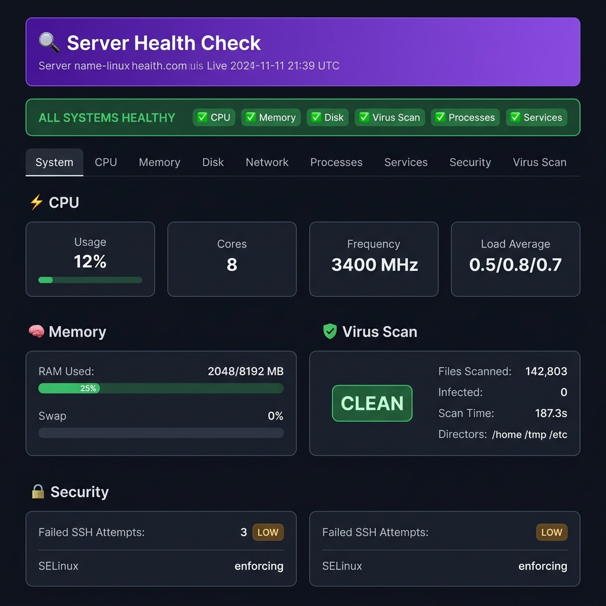

<div align="center">

# 🔍 Linux Server Health Check & Virus Scanner

**A Python tool that runs a full system audit + ClamAV virus scan and saves a beautiful HTML report to `/healthcheck/`.  
Fully automated with Jenkins — connects to all your servers (each with different passwords) and runs in parallel.**

[](https://python.org)
[](https://www.clamav.net/)
[](https://kernel.org)
[](LICENSE)
[]()

</div>

---

## 📸 Screenshot



---

## ✨ Features

| Category | What's Collected |
|---|---|
| 🖥️ **System** | OS, kernel, hostname, architecture, uptime |
| ⚡ **CPU** | Usage %, load average (1/5/15m), top processes |
| 🧠 **Memory** | RAM usage, swap usage, cached/buffered |
| 💾 **Disk** | All mount points, inode usage, large files (>100MB) |
| 🌐 **Network** | Interfaces, IPs, open ports, active connections |
| ⚙️ **Processes** | Total count, zombie detection, top memory users |
| 🔧 **Services** | SSH, cron, nginx, docker, fail2ban, firewall, etc. |
| 🔒 **Security** | Failed SSH attempts, world-writable files, active sessions |
| 🛡️ **Virus Scan** | Full ClamAV scan with infected file names + threat types |

**Output formats:** Timestamped HTML dashboard + JSON (machine-readable)

---

## 📁 Project Structure

```
healthcheck_app/
├── healthcheck.py     ← Main script — run this
├── syshealth.py       ← System metrics collector
├── scanner.py         ← ClamAV virus scanner
├── reporter.py        ← HTML + JSON report generator
├── install.sh         ← One-shot setup script
├── requirements.txt   ← No pip packages needed
└── README.md
```

---

## 🚀 Quick Start

### Step 1 — Copy files to your Linux server

```bash
scp -r healthcheck_app/ user@your-server:/opt/healthcheck_app/
```

### Step 2 — Install ClamAV and enable auto-scheduling

```bash
cd /opt/healthcheck_app
sudo bash install.sh
```

> `install.sh` will:
> - Install **ClamAV** via `apt` / `yum`
> - Update the virus signature database with `freshclam`
> - Create the `/healthcheck/` output directory
> - Register a **systemd timer** to run every 6 hours automatically

### Step 3 — Run manually

```bash
sudo python3 /opt/healthcheck_app/healthcheck.py
```

### Step 4 — Open the report

```
/healthcheck/latest.html                            ← Always the newest
/healthcheck/healthcheck_2026-07-12_10-10-00.html  ← Timestamped copy
/healthcheck/healthcheck_2026-07-12_10-10-00.json  ← JSON data
```

---

## ⚙️ CLI Options

```bash
sudo python3 healthcheck.py [OPTIONS]

  -o, --output-dir PATH       Save reports here (default: /healthcheck)
  -d, --scan-dirs DIR [...]   Directories to virus-scan
  -s, --skip-virus-scan       Skip ClamAV scan (faster, no AV check)
  -m, --max-filesize MB       Max file size to scan in MB (default: 100)
      --help                  Show help
```

**Examples:**

```bash
# Scan only web directories
sudo python3 healthcheck.py --scan-dirs /var/www /home /tmp

# Save to a custom path
sudo python3 healthcheck.py --output-dir /var/reports

# Quick health check without virus scan
sudo python3 healthcheck.py --skip-virus-scan

# Scan larger files too
sudo python3 healthcheck.py --max-filesize 500
```

---

## 🕒 Automatic Scheduling (systemd)

After running `install.sh`, the timer is already active:

```bash
# Check timer status
systemctl status healthcheck.timer

# View logs in real time
journalctl -u healthcheck.service -f

# Trigger a run right now
systemctl start healthcheck.service

# Change schedule (edit and reload)
nano /etc/systemd/system/healthcheck.timer
systemctl daemon-reload && systemctl restart healthcheck.timer
```

### Or use cron instead:

```bash
# Run daily at 3:00 AM
echo "0 3 * * * root python3 /opt/healthcheck_app/healthcheck.py" | sudo tee -a /etc/crontab
```

---

## 🔔 Exit Codes

| Code | Meaning |
|------|---------|
| `0` | Success — no infections found |
| `1` | Script error |
| `2` | **Virus / malware detected** |

Use in shell scripts or alerting pipelines:

```bash
sudo python3 healthcheck.py
STATUS=$?

if [ "$STATUS" -eq 2 ]; then
  echo "🔴 VIRUS DETECTED on $(hostname)!" | mail -s "ALERT" admin@example.com
elif [ "$STATUS" -eq 0 ]; then
  echo "✅ Server clean."
fi
```

---

## 📧 Email Reports (Optional)

```bash
# Send HTML report by email after each run
sudo python3 healthcheck.py && \
  mail -s "Health Report - $(hostname) - $(date +%Y-%m-%d)" \
  admin@example.com < /healthcheck/latest.html
```

---

## 📋 Requirements

| Requirement | Details |
|---|---|
| **OS** | Linux (Ubuntu, Debian, CentOS, RHEL, Arch) |
| **Python** | 3.6 or newer |
| **ClamAV** | Auto-installed by `install.sh` |
| **Privileges** | `sudo` / root (for full system access) |
| **pip packages** | ❌ None — uses only Python stdlib + system tools |

**System tools used** (all standard on Linux):
`ps`, `df`, `ip`, `ss`, `systemctl`, `who`, `last`, `find`, `grep`, `uptime`, `clamscan`, `freshclam`

---

## 🗂️ Sample JSON Output

```json
{
  "meta": {
    "generated_at": "2026-07-12_10-10-00",
    "hostname": "myserver.example.com"
  },
  "health": {
    "cpu": { "usage_pct": 12.4, "cores": 8, "load_1m": 0.52 },
    "memory": { "total_mb": 8192, "used_mb": 2048, "usage_pct": 25.0 },
    "disk": { "partitions": [ { "mountpoint": "/", "use_pct": "34%" } ] }
  },
  "virus_scan": {
    "infected": 0,
    "scanned": 142803,
    "scan_time_s": 187.3,
    "version": "ClamAV 1.2.1"
  }
}
```

---

## 🤖 Jenkins Automation (Multi-Server)

Run health checks across **all your servers simultaneously** — each with different passwords — straight from Jenkins.

### New Files

```
healthcheck_app/
├── Jenkinsfile          ← Declarative pipeline (add this to your Jenkins job)
├── servers.json         ← Your server inventory
└── jenkins/
    └── deploy_and_run.sh  ← SSH deploy + run + collect script
```

---

### ⚡ Jenkins Quick Setup (5 steps)

#### 1 — Install required Jenkins plugins

Go to `Manage Jenkins → Plugin Manager → Available`:
- ✅ **HTML Publisher** — renders reports in Jenkins UI
- ✅ **Pipeline Utility Steps** — for `readJSON()`
- ✅ **Email Extension (ext-email)** — for virus alert emails

#### 2 — Install `sshpass` on the Jenkins agent

```bash
# On the Jenkins agent machine (Linux):
sudo apt-get install -y sshpass
```

#### 3 — Add credentials for each server

Go to `Jenkins → Manage Jenkins → Credentials → Global → Add Credential`:

| Field | Value |
|---|---|
| Kind | **Username with password** |
| ID | Must match `cred_id` in `servers.json` (e.g. `server-prod-01`) |
| Username | SSH user (e.g. `root` or `ubuntu`) |
| Password | The server's SSH password |
| Description | e.g. "Production Web Server" |

> 🔒 Passwords are **never stored in files or git** — only in Jenkins Credentials Store.

#### 4 — Edit `servers.json` with your servers

```json
[
  {
    "host": "192.168.1.10",
    "label": "web-prod-01",
    "user": "root",
    "cred_id": "server-prod-01",
    "scan_dirs": "/home /var/www /tmp /etc",
    "description": "Production Web Server"
  },
  {
    "host": "192.168.1.11",
    "label": "db-prod-01",
    "user": "root",
    "cred_id": "server-prod-02",
    "scan_dirs": "/home /var/lib/mysql /tmp /etc",
    "description": "Production Database Server"
  }
]
```

#### 5 — Create the Jenkins Pipeline job

1. `New Item → Pipeline`
2. Under **Pipeline**, select **Pipeline script from SCM**
3. Point it to your Git repo containing `Jenkinsfile`
4. Save → **Build Now**

---

### 🔄 How the Pipeline Works

```
Jenkins Pipeline
│
├── Stage: Validate
│     └── Checks sshpass is installed, reads servers.json
│
└── Stage: Health Check — All Servers  (PARALLEL)
      ├── web-prod-01
      │     ├── SSH connect with password (from Credentials Store)
      │     ├── Deploy healthcheck_app/ files via SCP
      │     ├── Install ClamAV if missing
      │     ├── Update virus signatures (freshclam)
      │     ├── Run: sudo python3 healthcheck.py --scan-dirs ...
      │     └── Download HTML + JSON report back to Jenkins
      │
      ├── db-prod-01       (same steps, in parallel)
      └── app-staging-01   (same steps, in parallel)
│
├── Stage: Publish Reports
│     ├── Builds combined dashboard index page
│     ├── Archives all reports as build artifacts
│     └── Publishes HTML via HTML Publisher plugin
│
└── Post Build
      ├── 🟡 UNSTABLE → virus found → sends alert email with reports attached
      ├── 🔴 FAILURE  → connection/script error → sends failure email
      └── 🟢 SUCCESS  → all servers clean
```

---

### 📊 Pipeline Parameters

| Parameter | Default | Description |
|---|---|---|
| `ALERT_EMAIL` | `admin@example.com` | Email for virus alerts |
| `SKIP_VIRUS_SCAN` | `false` | Skip ClamAV (faster health-only run) |
| `MAX_FILESIZE_MB` | `100` | Max file size in MB to scan |

---

### ⏰ Schedule with Jenkins Cron

In your Pipeline job → **Build Triggers** → **Build periodically**:

```
# Every 6 hours
H */6 * * *

# Every day at 2 AM
0 2 * * *

# Every Sunday at midnight
0 0 * * 0
```

---

### 📁 Report Output

After each run, Jenkins publishes:

- **`🔍 Health Check Reports`** — clickable in Jenkins sidebar
- **Combined dashboard** — index page with all servers + status
- **Per-server reports** — `web-prod-01_latest.html`, `db-prod-01_latest.html`, etc.
- **JSON data** — `web-prod-01_latest.json` for scripting/alerting

---

## 📄 License

MIT License — free to use, modify, and distribute.

---

<div align="center">

Made with ❤️ for Linux sysadmins &nbsp;|&nbsp; **No dependencies. No bloat. Just Python.**

</div>
